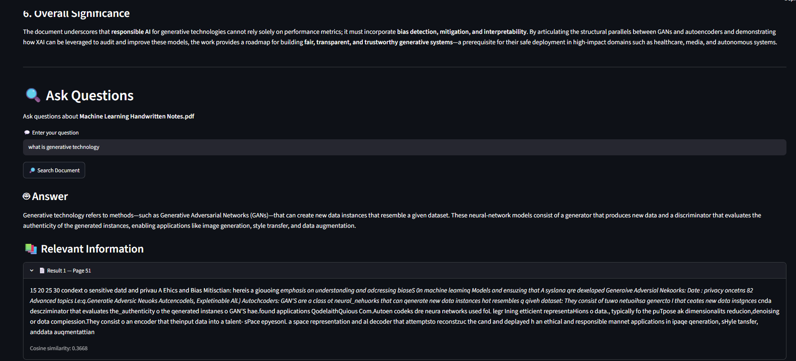

# 🤖 AI Document Assistant

An AI-powered **Retrieval-Augmented Generation (RAG)** application that allows users to upload PDF documents and interact with them using natural-language questions.

The system processes uploaded documents, extracts and chunks their content, generates semantic embeddings using **Sentence Transformers**, stores them in a **FAISS vector index**, retrieves the most relevant context for a user's query, and uses a **Groq-powered LLM** to generate grounded answers based only on the document content.

---

## 🚀 Overview

Reading and extracting information from large PDF documents can be time-consuming.

The **AI Document Assistant** solves this problem by transforming static PDF documents into an interactive knowledge source.

Users can:

* 📄 Upload PDF documents
* 🔍 Process and index document content
* 💬 Ask questions in natural language
* 🧠 Retrieve semantically relevant document sections
* 🤖 Generate AI-powered answers using RAG
* 📋 Generate document summaries
* ⚡ Interact with documents through a simple Streamlit interface

The application combines **Document Processing + Semantic Search + Vector Database + Large Language Models** into a single end-to-end AI system.

---

# ✨ Key Features

### 📄 PDF Document Upload

Upload PDF documents directly through the Streamlit interface.

The application extracts text from the uploaded document using **PyMuPDF**.

---

### ✂️ Intelligent Text Chunking

Large documents are divided into smaller overlapping chunks before embedding.

Current configuration:

* **Chunk Size:** 1000 characters
* **Chunk Overlap:** 200 characters

Overlapping chunks help preserve contextual information between adjacent sections.

---

### 🧠 Semantic Embeddings

The application converts document chunks into numerical vector representations using:

**Sentence Transformers — `all-MiniLM-L6-v2`**

This enables the system to understand semantic similarity rather than relying only on exact keyword matching.

---

### 🔎 Vector Similarity Search

Document embeddings are stored in a **FAISS** vector index.

FAISS performs efficient similarity search to identify document chunks that are most relevant to the user's question.

The system uses normalized embeddings with an `IndexFlatL2` index for similarity-based retrieval.

---

### 🤖 Retrieval-Augmented Generation

Instead of asking the LLM to answer from its general knowledge, the application first retrieves relevant information from the uploaded document.

The retrieved context is then passed to the LLM to generate a grounded response.

This helps reduce hallucination and keeps answers connected to the uploaded document.

---

### 💬 Natural Language Question Answering

Users can ask questions naturally, for example:

> "What is the main idea of this document?"

> "Explain the transformer architecture."

> "What are the key findings?"

The system retrieves relevant content and generates an answer based on the document.

---

### 📝 Document Summarization

The application also provides functionality to generate a concise summary of the uploaded document.

This makes it easier to understand lengthy documents without manually reading every page.

---

### 🖥️ Interactive Streamlit UI

The complete pipeline is exposed through a simple web interface built with **Streamlit**.

Users don't need to interact with the underlying Python pipeline directly.

---

# 🏗️ System Architecture

```text
                    ┌──────────────────────────┐
                    │        User              │
                    │                          │
                    │ Upload PDF / Ask Query   │
                    └────────────┬─────────────┘
                                 │
                                 ▼
                    ┌──────────────────────────┐
                    │      Streamlit UI        │
                    │        (app.py)          │
                    └────────────┬─────────────┘
                                 │
                 ┌───────────────┴────────────────┐
                 │                                │
                 ▼                                ▼
        ┌──────────────────┐            ┌──────────────────┐
        │  PDF Processing  │            │   User Query     │
        └────────┬─────────┘            └────────┬─────────┘
                 │                               │
                 ▼                               │
        ┌──────────────────┐                     │
        │ PyMuPDF Extraction│                    │
        └────────┬─────────┘                     │
                 │                               │
                 ▼                               │
        ┌──────────────────┐                     │
        │ Text Chunking    │                     │
        │ 1000 / 200       │                     │
        └────────┬─────────┘                     │
                 │                               │
                 ▼                               │
        ┌──────────────────┐                     │
        │ Sentence         │                     │
        │ Transformer      │                     │
        │ Embeddings       │                     │
        └────────┬─────────┘                     │
                 │                               │
                 ▼                               │
        ┌──────────────────┐                     │
        │ FAISS Vector     │◄────────────────────┘
        │ Index            │
        └────────┬─────────┘
                 │
                 ▼
        ┌──────────────────┐
        │ Similarity Search│
        │ Relevant Chunks  │
        └────────┬─────────┘
                 │
                 ▼
        ┌──────────────────┐
        │ Retrieved Context│
        └────────┬─────────┘
                 │
                 ▼
        ┌──────────────────┐
        │ Groq LLM         │
        │ GPT-OSS 120B     │
        └────────┬─────────┘
                 │
                 ▼
        ┌──────────────────┐
        │ Grounded Answer  │
        └──────────────────┘
```

---

# 🔄 How It Works

The application follows an end-to-end **RAG pipeline**.

## Step 1 — Upload PDF

The user uploads a PDF document through the Streamlit interface.

```text
PDF Document
     │
     ▼
Streamlit Upload
```

---

## Step 2 — Extract Text

The application uses **PyMuPDF** to extract text from the PDF.

```text
PDF
 │
 ▼
PyMuPDF
 │
 ▼
Extracted Text
```

The extracted text becomes the input for the document processing pipeline.

---

## Step 3 — Chunk the Document

Large documents are divided into smaller chunks.

Current configuration:

```text
Chunk Size    = 1000
Chunk Overlap = 200
```

Example:

```text
Document
│
├── Chunk 1
├── Chunk 2
├── Chunk 3
├── Chunk 4
└── ...
```

The overlap helps maintain context between neighboring chunks.

---

## Step 4 — Generate Embeddings

Each chunk is converted into a semantic vector using:

```text
all-MiniLM-L6-v2
```

Conceptually:

```text
Text Chunk
    │
    ▼
Sentence Transformer
    │
    ▼
384-dimensional Embedding
```

These embeddings allow the system to compare document content semantically.

---

## Step 5 — Store Embeddings in FAISS

The generated embeddings are stored in a FAISS vector index.

```text
Document Chunks
      │
      ▼
Embeddings
      │
      ▼
FAISS Index
```

The project uses normalized embeddings with:

```text
IndexFlatL2
```

for similarity-based retrieval.

---

## Step 6 — User Asks a Question

The user enters a natural-language question.

For example:

```text
"What is the main contribution of this paper?"
```

The query is converted into an embedding using the same embedding model.

```text
User Query
    │
    ▼
Sentence Transformer
    │
    ▼
Query Embedding
```

---

## Step 7 — Retrieve Relevant Context

The query embedding is compared with the vectors stored in FAISS.

The system retrieves the most relevant document chunks.

```text
Query Embedding
       │
       ▼
FAISS Similarity Search
       │
       ▼
Relevant Document Chunks
```

---

## Step 8 — Generate Answer Using LLM

The retrieved document context is provided to the Groq-powered LLM.

The LLM is instructed to answer using the retrieved document context rather than relying on unsupported information.

```text
Retrieved Context
       +
User Question
       │
       ▼
Groq LLM
       │
       ▼
Final Answer
```

---

## Step 9 — 📸 Demo



The user can continue asking questions about the document.

---

# 🧠 RAG Pipeline

The core intelligence of the application follows this pipeline:

```text
PDF
 │
 ▼
Text Extraction
 │
 ▼
Text Chunking
 │
 ▼
Embedding Generation
 │
 ▼
FAISS Vector Store
 │
 ▼
Query Embedding
 │
 ▼
Similarity Search
 │
 ▼
Relevant Context
 │
 ▼
LLM
 │
 ▼
Grounded Answer
```

### Why RAG?

A traditional LLM may not know the content of a private or newly uploaded document.

RAG solves this by dynamically retrieving relevant information from the document and providing it to the LLM as context.

This architecture combines:

* Information Retrieval
* Semantic Search
* Vector Databases
* Large Language Models

---

# 🛠️ Tech Stack

| Technology            | Purpose                     |
| --------------------- | --------------------------- |
| Python                | Core programming language   |
| Streamlit             | Web application interface   |
| PyMuPDF               | PDF text extraction         |
| Sentence Transformers | Semantic embeddings         |
| all-MiniLM-L6-v2      | Embedding model             |
| FAISS                 | Vector similarity search    |
| Groq                  | LLM inference               |
| GPT-OSS 120B          | Answer generation           |
| NumPy                 | Numerical/vector operations |
| Pickle                | Chunk persistence           |

---

# 📂 Project Structure

```text
ai-document-assistant/
│
├── app.py
├── requirements.txt
├── README.md
│
├── src/
│   ├── chunking.py
│   ├── document_loader.py
│   ├── document_processor.py
│   ├── embedding.py
│   ├── llm.py
│   ├── rag.py
│   ├── retriever.py
│   └── vector_store.py
│
├── data/
│   └── vector_store/
│       ├── research.index
│       └── chunks.pkl
│
└── ...
```

---

# 📌 Module Responsibilities

## `app.py`

Responsible for the Streamlit user interface.

Handles:

* PDF upload
* User interaction
* Question input
* Answer display
* Document processing interaction
* Summary generation

---

## `document_loader.py`

Responsible for loading and extracting content from PDF documents.

Uses **PyMuPDF** for PDF processing.

---

## `chunking.py`

Responsible for splitting extracted document text into manageable chunks.

Current configuration:

```python
chunk_size = 1000
chunk_overlap = 200
```

---

## `embedding.py`

Responsible for generating semantic embeddings using:

```text
all-MiniLM-L6-v2
```

---

## `vector_store.py`

Responsible for creating and managing the FAISS vector index.

The project uses:

```text
FAISS IndexFlatL2
```

with normalized embeddings.

---

## `retriever.py`

Responsible for retrieving the most relevant document chunks based on the user's query.

---

## `rag.py`

Coordinates the retrieval-augmented generation pipeline.

It connects:

```text
Query
 ↓
Retriever
 ↓
Relevant Context
 ↓
LLM
 ↓
Answer
```

---

## `llm.py`

Responsible for communicating with the Groq LLM and generating:

* Document-based answers
* Document summaries

The LLM is configured to use retrieved document context when answering questions.

---

## `document_processor.py`

Coordinates the document indexing pipeline:

```text
PDF
 ↓
Extraction
 ↓
Chunking
 ↓
Embedding
 ↓
FAISS Index
 ↓
Persistent Vector Store
```

---

# 📸 Screenshots

## 🖥️ Application Interface

Add your main Streamlit application screenshot here:

```text

```

---

## 📄 PDF Upload

Show the PDF upload interface:

```text

```

---

## 💬 Question Answering

Show an example of asking a question about the uploaded document:

```text

```

---

## 🧠 Document Summary

Show the generated document summary:

```text

```

---

## 🔎 Retrieved Context

If your UI displays retrieved chunks, add the screenshot here:

```text

```

> **Tip:** Create a `screenshots` folder in your repository and place your actual screenshots there.

---

# 🎯 Example Workflow

Suppose the user uploads a research paper.

### User uploads:

```text
attention_is_all_you_need.pdf
```

### System processes:

```text
PDF
 ↓
Extract 15 pages
 ↓
Create document chunks
 ↓
Generate embeddings
 ↓
Store vectors in FAISS
```

### User asks:

```text
"What is the Transformer architecture?"
```

### Retrieval:

```text
Question
 ↓
Query Embedding
 ↓
FAISS Search
 ↓
Relevant Transformer-related chunks
```

### Generation:

```text
Relevant Context
        +
Question
        ↓
     Groq LLM
        ↓
Document-grounded answer
```

---

# 🔐 Hallucination Control

The RAG prompt is designed to keep the model grounded in the retrieved document context.

The system instructs the model to:

* Use the provided document context
* Answer according to the available evidence
* Avoid inventing unsupported information
* Clearly indicate when information is not available in the document

This is especially important for document-based question answering.

---

# ⚙️ Installation

## 1. Clone the Repository

```bash
git clone https://github.com/Thekeshavjoshi/ai-document-assistant.git
```

Move into the project directory:

```bash
cd ai-document-assistant
```

---

## 2. Create a Virtual Environment

### Windows

```bash
python -m venv venv
```

Activate it:

```bash
venv\Scripts\activate
```

### Linux / macOS

```bash
python3 -m venv venv
source venv/bin/activate
```

---

## 3. Install Dependencies

```bash
pip install -r requirements.txt
```

---

# 🔑 Environment Variables

The project requires a Groq API key for LLM inference.

Create a `.env` file in the project root:

```env
GROQ_API_KEY=your_groq_api_key
```

### ⚠️ Security

Never commit your `.env` file or API keys to GitHub.

Add this to `.gitignore`:

```text
.env
venv/
__pycache__/
*.pyc
```

---

# ▶️ Run the Application

Start the Streamlit application:

```bash
streamlit run app.py
```

The application will open in your browser.

---

# 📋 Requirements

The project uses dependencies such as:

```text
streamlit
pymupdf
sentence-transformers
faiss-cpu
numpy
groq
python-dotenv
```

Install all dependencies using:

```bash
pip install -r requirements.txt
```

---

# 🧪 Tested With

The application has been tested with different PDF documents, including:

* Research papers
* Technical documents
* Computer science documents
* Interview preparation documents
* Large PDF files

Example:

```text
attention_is_all_you_need.pdf
```

The system successfully performs:

```text
PDF Upload
   ↓
Page Extraction
   ↓
Chunk Creation
   ↓
Embedding Generation
   ↓
FAISS Indexing
   ↓
Semantic Retrieval
   ↓
LLM Answer Generation
```

---

# 📊 Example Use Cases

### 🎓 Students

Ask questions about:

* Lecture notes
* Study material
* Research papers
* Books
* Course PDFs

---

### 🔬 Researchers

Interact with:

* Research papers
* Technical publications
* Scientific documents
* Literature reviews

---

### 💼 Professionals

Use the system for:

* Company documents
* Technical documentation
* Reports
* Manuals
* Internal knowledge bases

---

### 📚 Interview Preparation

Upload:

* Interview preparation PDFs
* Technical notes
* Programming documentation

and ask questions directly from the material.

---

# 💡 Why This Project?

This project demonstrates how modern AI systems can combine multiple components into a complete production-style pipeline.

Instead of simply calling an LLM API, the project implements the complete flow:

```text
Document Processing
        +
Embeddings
        +
Vector Search
        +
Information Retrieval
        +
LLM Generation
        =
RAG Application
```

It demonstrates practical understanding of:

* NLP
* Semantic Search
* Embeddings
* Vector Databases
* Retrieval-Augmented Generation
* LLM Integration
* Prompt Engineering
* API Integration
* Streamlit Deployment

---

# 🧩 Technical Highlights

### Embedding Model

```text
Sentence Transformers
all-MiniLM-L6-v2
```

Embedding dimension:

```text
384
```

---

### Vector Database

```text
FAISS
IndexFlatL2
```

Normalized embeddings are used for similarity-based retrieval.

---

### Chunking

```text
Chunk Size:    1000
Overlap:       200
```

---

### LLM

```text
Groq
GPT-OSS 120B
```

---

# 🔮 Future Improvements

The project can be further enhanced with:

* [ ] Multi-document conversations
* [ ] Conversation memory
* [ ] Improved retrieval ranking
* [ ] Hybrid keyword + semantic search
* [ ] Metadata-aware retrieval
* [ ] Reranking models
* [ ] Page-level source citations
* [ ] Clickable source references
* [ ] Better full-document summarization
* [ ] Streaming LLM responses
* [ ] Chat history
* [ ] Persistent user sessions
* [ ] OCR support for scanned PDFs
* [ ] Table extraction
* [ ] Image-aware document understanding
* [ ] Cloud deployment
* [ ] Authentication and user management

---

# 🚀 Possible Future Architecture

```text
                 ┌─────────────────────┐
                 │      User           │
                 └──────────┬──────────┘
                            │
                            ▼
                 ┌─────────────────────┐
                 │    Streamlit UI     │
                 └──────────┬──────────┘
                            │
                            ▼
                 ┌─────────────────────┐
                 │ Document Processing │
                 └──────────┬──────────┘
                            │
                            ▼
                 ┌─────────────────────┐
                 │ Embedding Pipeline  │
                 └──────────┬──────────┘
                            │
                            ▼
                 ┌─────────────────────┐
                 │ Vector Database     │
                 │       FAISS         │
                 └──────────┬──────────┘
                            │
                            ▼
                 ┌─────────────────────┐
                 │ Retrieval +         │
                 │ Reranking           │
                 └──────────┬──────────┘
                            │
                            ▼
                 ┌─────────────────────┐
                 │      LLM            │
                 │    GPT-OSS 120B     │
                 └──────────┬──────────┘
                            │
                            ▼
                 ┌─────────────────────┐
                 │ Grounded Response   │
                 └─────────────────────┘
```

---

# 📈 Learning Outcomes

Through this project, the following practical concepts were implemented:

### Machine Learning / NLP

* Text preprocessing
* Semantic representations
* Embeddings
* Similarity search

### Generative AI

* LLM integration
* Prompt engineering
* Context injection
* Grounded generation

### RAG

* Document ingestion
* Chunking
* Embedding generation
* Vector indexing
* Retrieval
* Context-aware generation

### Software Development

* Modular Python architecture
* API integration
* Environment variable management
* Streamlit application development
* Git/GitHub version control

---

# 🏆 Project Highlights

```text
✔ End-to-end RAG pipeline
✔ PDF document understanding
✔ Semantic vector search
✔ FAISS vector indexing
✔ Sentence Transformer embeddings
✔ Groq LLM integration
✔ Context-grounded answers
✔ Document summarization
✔ Modular Python architecture
✔ Interactive Streamlit interface
```

---

# 🔗 Repository

**GitHub Repository:**

https://github.com/Thekeshavjoshi/ai-document-assistant

---

# 👨‍💻 Author

## Keshav Joshi

**AI/ML Engineer | Generative AI | NLP | RAG | LLMs**

Interested in building practical AI systems using Machine Learning, Deep Learning, NLP, Generative AI, RAG, and Agentic AI.

---

# ⭐ If You Like This Project

If you find this project useful or interesting:

⭐ Star the repository
🍴 Fork the project
💡 Explore the implementation
📢 Share it with others interested in AI/ML

---

## 📜 License

This project is intended for educational and portfolio purposes.

---

## 💬 Final Note

The **AI Document Assistant** demonstrates how an LLM can be combined with a document retrieval pipeline to create a practical, domain-specific AI assistant.

Rather than relying entirely on the model's pre-trained knowledge, the system retrieves relevant information from the user's document and uses that information to generate contextual responses.

```text
Your Documents
      ↓
Understand
      ↓
Search
      ↓
Retrieve
      ↓
Generate
      ↓
Answer
```

**AI Document Assistant — Turn your PDFs into an interactive knowledge base. 🚀**
